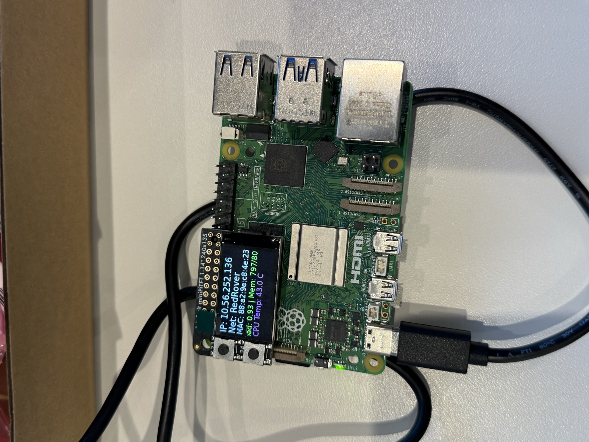
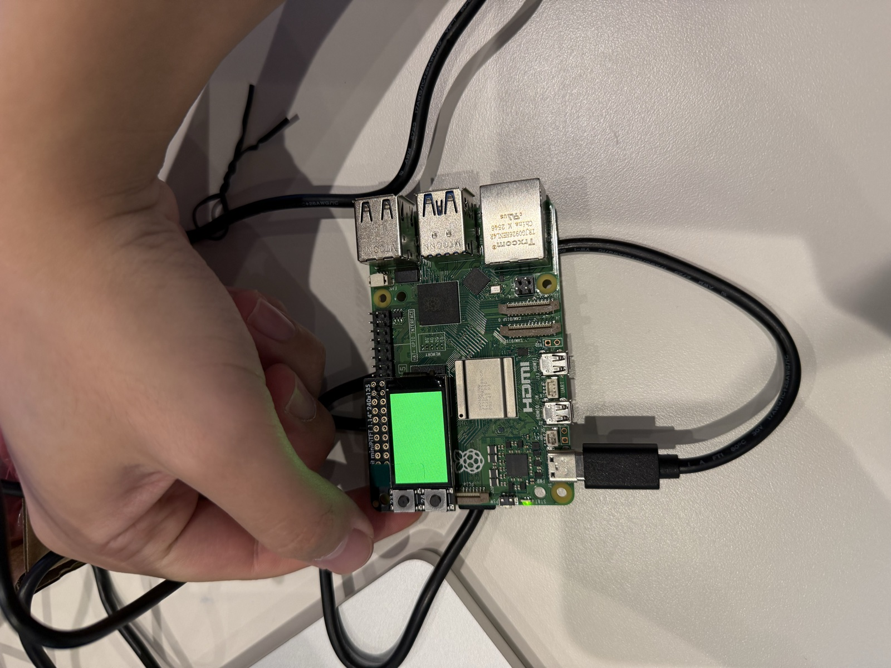
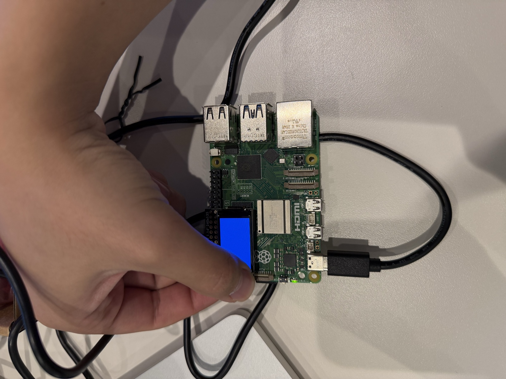
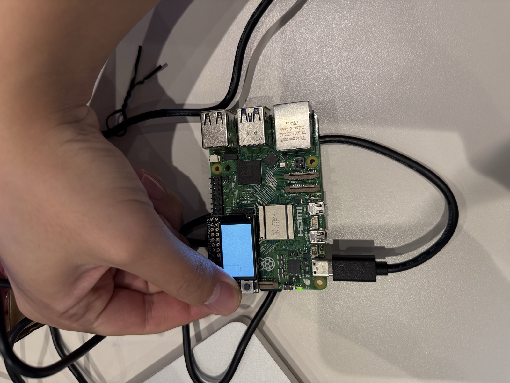
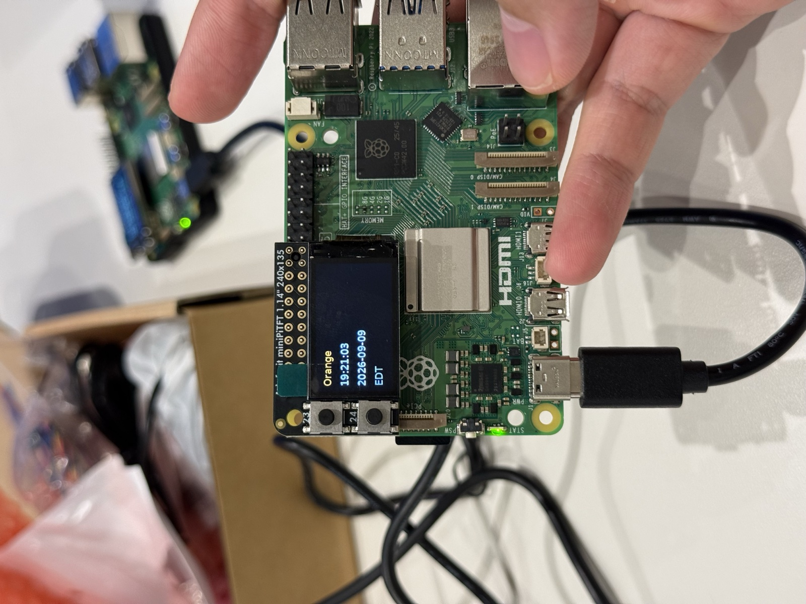
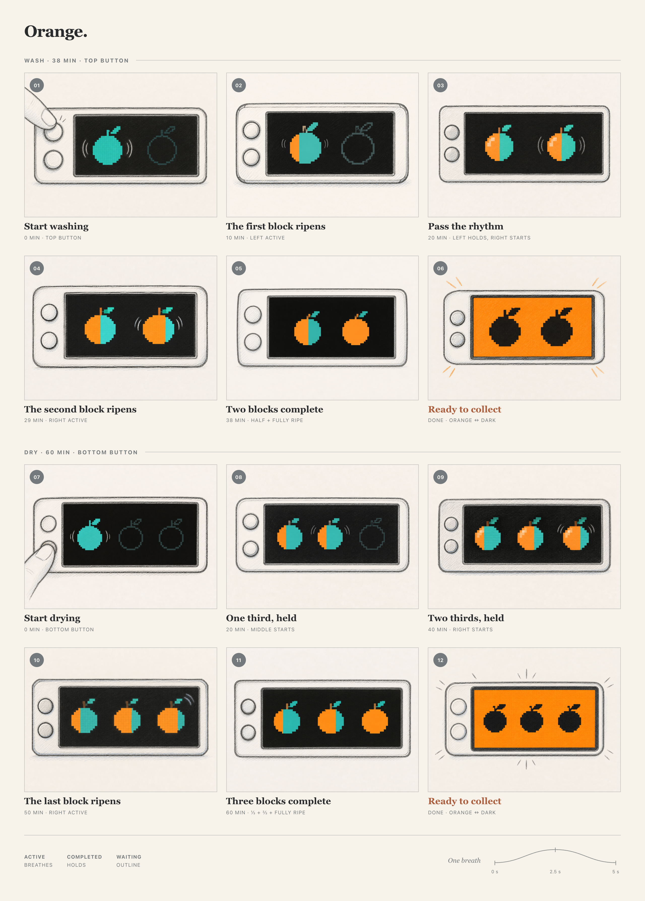

# Interactive Prototyping: The Clock of Pi
**NAMES OF COLLABORATORS HERE**

> **How to read this page:** my own responses are set in blockquotes like this
> one, to separate them from the original assignment text.

---

Does it feel like time is moving strangely during this semester?

For our first Pi project, we will pay homage to the [timekeeping devices of old](https://en.wikipedia.org/wiki/History_of_timekeeping_devices) by making simple clocks.

It is worth spending a little time thinking about how you mark time, and what would be useful in a clock of your own design.

**Please indicate anyone you collaborated with on this Lab here.**
Be generous in acknowledging their contributions! And also recognizing any other influences (e.g. from YouTube, Github, Twitter) that informed your design. 

## Prep

1. ### Set up your Lab 2 Github

At the start of lab Wednesday, ensure you have the latest lab content by updating your forked repository. 

**📖 [Follow the step-by-step guide for safely updating your fork](pull_updates/README.md)**

This guide covers how to pull updates without overwriting your completed work, handle merge conflicts, and recover if something goes wrong.


2. ### Get Kit and Inventory Parts
Take inventory of the kit parts that you have, and note anything that is missing:

***Update your [parts list inventory](partslist.md)***

3. ### Prepare your Pi for lab this week
[Follow these instructions](prep.md) to download and burn the image for your Raspberry Pi before lab Wednesday.


## Overview
For this assignment, you are going to 

A) [Connect to your Pi](#part-a)  

B) [Try out cli_clock.py](#part-b) 

C) [Set up your RGB display](#part-c)

D) [Try out clock_display_demo](#part-d) 

E) [Modify the code to make the display your own](#part-e)

F) [Make a short video of your modified barebones PiClock](#part-f)

G) [Sketch and brainstorm further interactions and features you would like for your clock for Part 2.](#part-g)

## The Report
This readme.md page in your own repository should be edited to include the work you have done. You can delete everything but the headers and the sections between the \*\*\***stars**\*\*\*. Write the answers to the questions under the starred sentences. Include any material that explains what you did in this lab hub folder, and link it in the readme.

Labs are due on Sunday midnight. Make sure this page is linked to on your main class hub page.

## Part A. 
### Connect to your Pi
Just like you did in the lab prep, ssh on to your pi. Once you get there, create a Python environment (named venv) by typing the following commands.

```
ssh pi@<your Pi's IP address>
...
pi@raspberrypi:~ $ python -m venv venv
pi@raspberrypi:~ $ source venv/bin/activate
(venv) pi@raspberrypi:~ $ 

```
> My Pi is a Raspberry Pi 5, and I named it **Orange**. No deep reason, it just
> needed a name that wasn't `raspberrypi`. I flashed the course image, SSH'd in
> from my Mac, changed the hostname, then disconnected and reconnected to make
> sure the new name had actually stuck. The little screen on top was already
> showing me it was on RedRover, which was reassuring.
>
> One thing I did differently from the instructions: instead of using the
> `~/venv` that ships with the image, I made a fresh Python 3.11 environment
> inside the repo at `~/Interactive-Lab-Hub/.venv`. The image's `~/venv` is what
> the boot-screen service uses, and I didn't want a stray `pip install` of mine
> to break the one thing that tells me the Pi's IP address. So my routine after
> `ssh Orange` (I set up an alias on the Mac) looks like:
>
> ```bash
> cd ~/Interactive-Lab-Hub
> source .venv/bin/activate
> cd "Lab 2"
> ```
>
> The `.venv`, Python caches, and local config files are gitignored, so none of
> that ends up in the repo.

### Setup Personal Access Tokens on GitHub
Set your git name and email so that commits appear under your name.
```
git config --global user.name "Your Name"
git config --global user.email "yourNetID@cornell.edu"
```

The support for password authentication of GitHub was removed on August 13, 2021. That is, in order to link and sync your own lab-hub repo with your Pi, you will have to set up a "Personal Access Tokens" to act as the password for your GitHub account on your Pi when using git command, such as `git clone` and `git push`.

Following the steps listed [here](https://docs.github.com/en/authentication/keeping-your-account-and-data-secure/managing-your-personal-access-tokens) from GitHub to set up a token. Depends on your preference, you can set up and select the scopes, or permissions, you would like to grant the token. This token will act as your GitHub password later when you use the terminal on your Pi to sync files with your lab-hub repo.


> I do all my GitHub pushing from my Mac, where the `gh` CLI is already logged in
> as `certaindragon3` and has push access to
> [my Lab Hub](https://github.com/certaindragon3/Interactive-Lab-Hub) (branch
> `Fall2026`). Git is set to my name and email so commits show up as me. I
> haven't set up a token on Orange itself yet. So far I've been moving files
> between the Mac and the Pi directly (more on why in Part B), so the Pi hasn't
> needed to talk to GitHub on its own.

## Part B. 
### Try out the Command Line Clock
Clone your own lab-hub repo for this assignment to your Pi and change the directory to Lab 2 folder (remember to replace the following command line with your own GitHub ID):

```
(venv) pi@raspberrypi:~$ git clone https://github.com/<YOURGITID>/Interactive-Lab-Hub.git
(venv) pi@raspberrypi:~$ cd Interactive-Lab-Hub/Lab\ 2/
```
Depends on the setting, you might be asked to provide your GitHub user name and password. Remember to use the "Personal Access Tokens" you just set up as the password instead of your account one!

Check if the directory has clone sucessfully, you should see the Interactive-Lab-Hub under the home directory listed:
```
(venv) pi@raspberrypi:~ $ ls
Bookshelf      Documents            Music     Public                 venv
create_img.sh  Downloads            pi-apps   screen_boot_script.py  Videos
Desktop        Interactive-Lab-Hub  Pictures  Templates
(venv) pi@raspberrypi:~ $
```


Install the packages from the requirements.txt and run the example script `cli_clock.py`:

```
(venv) pi@raspberrypi:~/Interactive-Lab-Hub/Lab 2 $ pip install -r requirements.txt
(venv) pi@raspberrypi:~/Interactive-Lab-Hub/Lab 2 $ python cli_clock.py 
02/24/2021 11:20:49
```

The terminal should show the time, you can press `ctrl-c` to exit the script.
If you are unfamiliar with the Python code in `cli_clock.py`, have a look at [this Python refresher](https://hackernoon.com/intermediate-python-refresher-tutorial-project-ideas-and-tips-i28s320p). If you are still concerned, please reach out to the teaching staff!


> [cli_clock.py](cli_clock.py) does what it says on the tin: a timestamp that
> overwrites itself once a second on the same line. I watched it tick for a few
> seconds and killed it with `ctrl-c`. The trick is small but nice. `strftime()`
> formats the time, `\r` jumps the cursor back to the start of the line instead
> of printing a new one, and `sleep(1)` sets the pace.
>
> The funny part was that the very first run confidently printed a date that
> was clearly wrong. The clock was "working" perfectly, it just wasn't right,
> because the Pi's system clock was wherever the course image had left it. Good
> reminder that a clock program is only as honest as the clock underneath it. I
> fixed the system time before moving on to the screen version in Part D.
>
> Getting the code onto the Pi was more annoying than expected. Orange couldn't
> reach GitHub or PyPI at first, so `git clone` and `pip install` both went
> nowhere. Instead I packed the repo into a Git bundle on my Mac, copied it
> over, and installed the dependencies offline. All 20 packages in
> [requirements.txt](requirements.txt) came up at the expected versions,
> `pip check` was happy, and the display libraries imported without complaint.

## Part C. 
### Set up your RGB Display
We have asked you to equip the [Adafruit MiniPiTFT](https://www.adafruit.com/product/4393) on your Pi in the Lab 2 prep already. Here, we will introduce you to the MiniPiTFT and Python scripts on the Pi with more details.


The Raspberry Pi 5 has a variety of interfacing options. When you plug the pi in the red power LED turns on. Any time the SD card is accessed the green LED flashes. It has standard USB ports and HDMI ports. Less familiar it has a set of 20x2 pin headers that allow you to connect a various peripherals.


To learn more about any individual pin and what it is for go to [pinout.xyz](https://pinout.xyz/pinout/3v3_power) and click on the pin. Some terms may be unfamiliar but we will go over the relevant ones as they come up.

### Hardware (you have already done this in the prep)

From your kit take out the display and the [Raspberry Pi 5](https://www.google.com/url?sa=i&url=https%3A%2F%2Fwww.raspberrypi.com%2Fproducts%2Fraspberry-pi-5%2F&psig=AOvVaw330s4wIQWfHou2Vk3-0jUN&ust=1757611779758000&source=images&cd=vfe&opi=89978449&ved=0CBMQjRxqFwoTCPi1-5_czo8DFQAAAAAdAAAAABAE)

Line up the screen and press it on the headers. The hole in the screen should match up with the hole on the raspberry pi.

<p float="left">


</p>

### Testing your Screen

The display uses a communication protocol called [SPI](https://www.circuitbasics.com/basics-of-the-spi-communication-protocol/) to speak with the raspberry pi. We won't go in depth in this course over how SPI works. The port on the bottom of the display connects to the SDA and SCL pins used for the I2C communication protocol which we will cover later. GPIO (General Purpose Input/Output) pins 23 and 24 are connected to the two buttons on the left. GPIO 22 controls the display backlight.

To show you the IP and Mac address of the Pi to allow connecting remotely we created a service that launches a python script that runs on boot. For the following steps stop the service by typing ``` sudo systemctl stop piscreen.service --now```. Othwerise two scripts will try to use the screen at once. You may start it again by typing ``` sudo systemctl start piscreen.service --now```

We can test it by typing 
```
(venv) pi@raspberrypi:~/Interactive-Lab-Hub/Lab 2 $ python screen_test.py
```

You can type the name of a color then press either of the buttons on the MiniPiTFT to see what happens on the display! You can press `ctrl-c` to exit the script. Take a look at the code with
```
(venv) pi@raspberrypi:~/Interactive-Lab-Hub/Lab 2 $ cat screen_test.py
```

#### Displaying Info with Texts
You can look in `screen_boot_script.py` for how to display text on the screen!

#### Displaying an image

You can look in `image.py` for an example of how to display an image on the screen. Can you make it switch to another image when you push one of the buttons?

\*\*\***Include a picture of your own Raspberry Pi displaying the piscreen.service with your unique MAC address. Additionally, please provide another picture showing the successful completion of the screen test.**\*\*\*


> Here's Orange at boot showing its network info. The MAC address,
> `88:a2:9e:c8:4e:23`, is the part that matters. The IP is just whatever
> RedRover handed out that day.
>
> 
>
> For the screen test I typed `blue` as my color. Nothing pressed gives green,
> button A gives white, button B gives blue. It's a tiny thing, but seeing the
> screen react the instant I pressed a button was the first moment the Pi felt
> like a device rather than a computer I happened to be SSH'd into.
>
> | Neither button: green | Button B: blue | Button A: white |
> | --- | --- | --- |
> |  |  |  |
>
> (The "white" photo reads a bit blue. That's my phone camera, not the screen.)
> I didn't photograph the both-buttons-at-once case, which turns the backlight
> off. Before running the test I stopped `piscreen.service`, otherwise the boot
> script and the test script fight over the screen.

## Part D. 
### Set up the Display Clock Demo
Work on `screen_clock.py`, try to show the time by filling in the while loop (at the bottom of the script where we noted "TODO" for you). You can use the code in `cli_clock.py` and `stats.py` to figure this out.

> I filled in the `while` loop in [screen_clock.py](screen_clock.py). Each pass
> reads the local time once, wipes the image, draws the Pi's name, the time, the
> date, and the timezone with Pillow, and pushes the frame to the display. Do
> that once a second and you get a clock:
>
> 
>
> That's 19:21:03 on September 9, 2026, in EDT, which really was the correct
> time when I took the photo. Getting there took some doing. I set the timezone
> to `America/New_York` and corrected the time by hand, because NTP was enabled
> but still hadn't managed to sync when I last checked. So right now this clock
> is right because I intervened, not on its own. Something to fix before Part 2.
>
> Otherwise it was uneventful: the copy on the Pi matched the one on my Mac, it
> compiled and ran cleanly, and the screen showed what I expected.
>
> Honestly, this is the boring version, a digital readout on a small screen. It
> works, which is the point of Part D, but for Part 2 I want the clock to *do*
> something with time rather than just print it.

### How to Edit Scripts on Pi
Option 1. One of the ways for you to edit scripts on Pi through terminal is using [`nano`](https://linuxize.com/post/how-to-use-nano-text-editor/) command. You can go into the `screen_clock.py` by typing the follow command line:
```
(venv) pi@raspberrypi:~/Interactive-Lab-Hub/Lab 2 $ nano screen_clock.py
```
You can make changes to the script this way, remember to save the changes by pressing `ctrl-o` and press enter again. You can press `ctrl-x` to exit the nano mode. There are more options listed down in the terminal you can use in nano.

Option 2. Another way for you to edit scripts is to use VNC on your laptop to remotely connect your Pi. Try to open the files directly like what you will do with your laptop and edit them. Since the default OS we have for you does not come up a python programmer, you will have to install one yourself otherwise you will have to edit the codes with text editor. [Thonny IDE](https://thonny.org/) is a good option for you to install, try run the following command lines in your Pi's ternimal:

  ```
  pi@raspberrypi:~ $ sudo apt install thonny
  pi@raspberrypi:~ $ sudo apt update && sudo apt upgrade -y
  ```

Now you should be able to edit python scripts with Thonny on your Pi.

Option 3. A nowadays often preferred method is to use Microsoft [VS code to remote connect to the Pi](https://www.raspberrypi.com/news/coding-on-raspberry-pi-remotely-with-visual-studio-code/). This gives you access to a fullly equipped and responsive code editor with terminal and file browser.  

Pro Tip: Using tools like [code-server](https://coder.com/docs/code-server/latest) you can even setup a VS Code coding environment hosted on your raspberry pi and code through a web browser on your tablet or smartphone! 

## Part E. Read Part 2. Sketch and brainstorm further interactions and features you would like for your clock.

One potential source of ideas might be thinking about other clocks and timekeeping devices for inspiration.

Another might be novel units of time. How do you measure a year? [In daylights? In midnights? In cups of coffee?](https://www.youtube.com/watch?v=wsj15wPpjLY)

We strongly discourage literal digital or analog clock display: Be creative.


** Insert ideas, sketches, [Verplank diagrams](https://ccrma.stanford.edu/courses/250a-fall-2004/IDSketchbok.pdf)), storyboards for your ideas **

> **Orange: a laundry timer.** My washer takes 38 minutes and my dryer takes
> 60. Those are the two stretches of time I actually want this device to help
> me keep track of. I named the Pi Orange, so the display will be a row of
> pixel oranges that slowly ripen from teal to orange.
>
> After starting the washer, I press the top button. After starting the dryer,
> I press the bottom button. Washing gets two fruit positions; drying gets
> three. Time moves from left to right through the row:
>
> | Routine | Active block | Color change in that fruit |
> | --- | --- | --- |
> | Wash, 38 min | Left, 0–20 min | Teal → half orange |
> | Wash, 38 min | Right, 20–38 min | Half orange → fully orange |
> | Dry, 60 min | Left, 0–20 min | Teal → one-third orange |
> | Dry, 60 min | Middle, 20–40 min | One-third → two-thirds orange |
> | Dry, 60 min | Right, 40–60 min | Two-thirds → fully orange |
>
> Only the current fruit breathes: dim, bright, dim, once every five seconds.
> Its color changes much more slowly, over the whole block. When a block ends,
> that fruit stops breathing and keeps its color. The next one picks up from
> the same ripeness. The storyboard uses dim outlines for blocks that haven't
> started yet, so the active position is easier to find.
>
> At the end, the contrast flips. The screen flashes orange around two black
> fruit silhouettes for washing, or three for drying. The final panels below
> show the bright phase of that alert. The preceding panels separate out the
> instant the last fruit ripens; they aren't an extra waiting period.
>
> 
>
> [HTML layout](storyboard-orange.html) ·
> [Full-resolution PNG, 2560 × 3574](storyboard-orange-render.png) ·
> [Individual-frame image prompts](assets/storyboard-orange/prompts.md)
>
> This is the Part E concept, before implementation or user testing. One
> hardware correction to my initial idea: the current Mini PiTFT is a color
> TFT, not an OLED. It can draw the black silhouettes, but its backlight will
> still be on. I also need to test whether the final signal catches my
> attention from where I actually leave the timer. A visual reminder only
> helps if I can see it.
>
> My first prototype will speed the minutes up to seconds so I can check the
> handoffs without waiting an hour. After that I want to settle how to dismiss
> the alert and prevent an accidental button press from restarting or switching
> a running timer. Those behaviors are still open design decisions.
>
> **AI contribution:** I supplied the laundry routines, timing, ripening
> sequence, button mapping, and completion effect. Codex used Imagegen to
> generate each of the twelve illustrations separately, taking the pencil
> style from my Lab 1 storyboard. The numbering, captions, and page layout are
> HTML/CSS. 


**Put the names of the people you gave feedback to here. (Even better, add links to their repos here!)**

> I gave my feedback as GitHub commit comments on each person's Lab 2 README commit (their repos have Issues turned off); links to each comment below.
>
> - [umasshia](https://github.com/umasshia/Interactive-Lab-Hub/tree/Fall2026/Lab%202), Who Can I Call Clock: [my comment](https://github.com/umasshia/Interactive-Lab-Hub/commit/e78a25bb0bb4f3f517b6325014c1babbbd1a63b5#commitcomment-200406215)
> - [aurorajxshen](https://github.com/aurorajxshen/Interactive-Lab-Hub/tree/Fall2026/Lab%202), metabolism clock: [my comment](https://github.com/aurorajxshen/Interactive-Lab-Hub/commit/86b23e3a2ccd7bc220c8c132ce0dc53089db878a#commitcomment-200406223)
> - [Flora130](https://github.com/Flora130/Interactive-Lab-Hub/tree/Fall2026/Lab%202), sleep clock: [my comment](https://github.com/Flora130/Interactive-Lab-Hub/commit/69ddda4fdad80d047e8c7e2505d55b238327d09d#commitcomment-200406229)
> - [manrongm](https://github.com/manrongm/Interactive-Lab-Hub/tree/mm3599-lab2a/Lab%202), Time as Progress: [my comment](https://github.com/manrongm/Interactive-Lab-Hub/commit/8ae0e991cea792aa9f6dbd1f4c25c4cb65b89113#commitcomment-200408359)

# Lab 2 Part 2

## Prep 

1. Pick up remaining parts for kit on Wednesday lab class. Check the updated [parts list inventory](partslist.md) and let the TA know if there is any part missing.

2. Look at and give feedback on the Part E. for at least 3 other people in the class and get 3 people to comment on your Part E!)
**Put the feedback for your ideas here.**

> **Mandy (shared with me directly):**
>
> I liked how you worked both the technical process and the problems you ran into during the lab. Your explanation of using a separate virtual environment was clear, and it showed that you were thinking about how to avoid breaking the Pi’s boot-screen service. I also liked the Part E idea because the laundry timer connects time to a real daily routine instead of using a normal digital clock. The orange ripening concept makes the passage of time easy to understand visually, and the two buttons give the interaction a simple purpose. The storyboard and timing breakdown also made the idea easy to follow. One thing I would still be curious about is how the user will dismiss the final alert or avoid accidentally restarting the timer.
>
> **[TerenceZhang29](https://github.com/TerenceZhang29/Interactive-Lab-Hub) ([commit comment](https://github.com/certaindragon3/Interactive-Lab-Hub/commit/fe704d2497fc9b2a02305ed1ede5b3185a8bf17d#commitcomment-200408418)):**
>
> it's a timer, not a clock — give it an "after" state. The ripening row runs 0→100% and then stops, which is a progress bar with a nicer skin. The most interesting laundry question isn't "is it done" (the machine beeps) but "how long has it been sitting there wet?" Let the fruit keep going past ripe into overripe/spotted. That turns the device back into something that displays elapsed time rather than counting down, and it's a genuinely novel unit: laundry measured in fruit decay.
>
> **[Wenqing Pan](https://github.com/WenqingPan-Lucy/Interactive-Lab-Hub/tree/WenqingPan_Lab/Lab%202) (in person):**
>
> Most of their feedback was about how the timer gets stopped: how do I dismiss the
> final alert, and what stops a stray button press from restarting or switching a
> running timer? That is the same open question Mandy raised. My current plan is to
> stop a running timer by pressing both buttons at once, since neither single
> button is free — A starts the wash and B starts the dry.

## Update your Lab Hub

[Update your Lab Hub](pull_updates/README.md) to get the latest content and requirements for Part 2.

## Modify the barebones clock to make it your own

Start small, pick just one element of your overall idea, just to show you have a handle on the code and components.

\*\*\***Put a copy of your code in your Lab 2 Github repo.**\*\*\*

## Make a short video of your modified barebones PiClock

\*\*\***Take a video of your barely modified PiClock.**\*\*\*

After you edit and work on the scripts for Lab 2, the files should be upload back to your own GitHub repo! You can push to your personal github repo by adding the files here, commiting and pushing.

```
(venv) pi@raspberrypi:~/Interactive-Lab-Hub/Lab 2 $ git add .
(venv) pi@raspberrypi:~/Interactive-Lab-Hub/Lab 2 $ git commit -m 'your commit message here'
(venv) pi@raspberrypi:~/Interactive-Lab-Hub/Lab 2 $ git push
```

After that, Git will ask you to login to your GitHub account to push the updates online, you will be asked to provide your GitHub user name and password. Remember to use the "Personal Access Tokens" you set up in Part A as the password instead of your account one! Go on your GitHub repo with your laptop, you should be able to see the updated files from your Pi!

## Now, make your own PiClock

Do take advantage of having done the previous iteration to refine and simplify your design.

** Insert any updates ideas, sketches, [Verplank diagrams](https://ccrma.stanford.edu/courses/250a-fall-2004/IDSketchbok.pdf))!, storyboards for your ideas **


\*\*\***Put a copy of your code in your Lab 2 Github repo.**\*\*\*

\*\*\***Take a video of your PiClock.**\*\*\*


As always, make sure you document contributions and ideas from others (and AI) explicitly in your writeup.

You are permitted (but not required) to work in groups and share a turn in; you are expected to make equal contribution on any group work you do, and N people's group project should look like N times the work of a single person's lab.  Make sure the page for the group turn in is linked to your personal Interactive Lab Hub page. 
