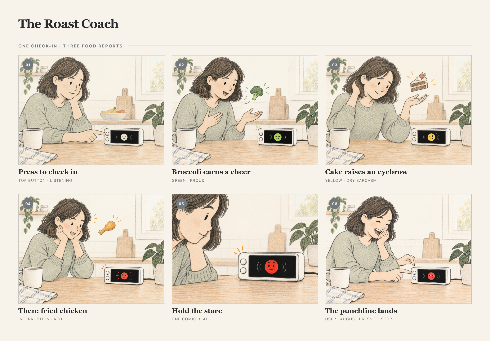

# Chatterboxes

**NAMES OF COLLABORATORS HERE**

> **Jiesen Huang.** I tested the Part 1 speech interaction on Orange. Codex
> assisted with remote setup, scripts, this writeup, and the storyboard illustrations
> and layout; I provided the speech and listening observations and the coach concept.

> **How to read this page:** my own responses are set in blockquotes like this
> one, to separate them from the original assignment text.

[](https://youtu.be/LZ0VJClIlRI?si=Yy84mcyVYuVV19mn)

In this lab, we want you to design interaction with a speech-enabled device — something that listens and talks to you. This device can do anything *but* control lights (since we already did that in Lab 1). First, we want you to storyboard what you imagine the conversational interaction to be like. Then you will use wizarding techniques to elicit examples of what people might say, ask, or respond. We then want you to use the examples collected from at least two other people to inform the redesign of the device.

We will focus on **audio** as the main modality for interaction to start; these general techniques can be extended to **video**, **haptics** or other interactive mechanisms in the second part of the Lab.

A note on what you are building with. Speech interfaces are usually taught as two boxes — speech-in, speech-out — and that framing hides the part that actually determines whether an interaction works. Between listening and speaking sits the question of **whose turn it is**: when does the device decide you have finished talking, and how long does it make you wait before it answers? This lab gives you direct control over both, and we will ask you to notice what changes when you move them.

## Prep for Part 1: Get the Latest Content and Pick up Additional Parts

Please check instructions in [prep.md](prep.md) and complete the setup.

### Pick up Web Camera If You Don't Have One

Students who have not already received a web camera will receive their Webcam and at the beginning of lab. If you cannot make it to class this week, please contact the TAs to ensure you get these.

### Get the Latest Content

As always, pull updates from the class Interactive-Lab-Hub to both your Pi and your own GitHub repo.

**\[recommended\]** Option 1: On the Pi, `cd` to your `Interactive-Lab-Hub`, pull the updates from upstream (class lab-hub) and push the updates back to your own GitHub repo. You will need the *personal access token* for this.

```
pi@ixe00:~$ cd Interactive-Lab-Hub
pi@ixe00:~/Interactive-Lab-Hub $ git pull upstream Fall2026
pi@ixe00:~/Interactive-Lab-Hub $ git add .
pi@ixe00:~/Interactive-Lab-Hub $ git commit -m "get lab3 updates"
pi@ixe00:~/Interactive-Lab-Hub $ git push
```

Option 2: On your own GitHub repo, create a pull request to get updates from the class Interactive-Lab-Hub. After you have the latest updates online, go to your Pi, `cd` to your `Interactive-Lab-Hub` and use `git pull`.

---

# Part 1

## Setup

Create and activate a virtual environment for this lab:

```
pi@ixe00:~$ cd Interactive-Lab-Hub/Lab\ 3
pi@ixe00:~/Interactive-Lab-Hub/Lab 3 $ python3 -m venv .venv
pi@ixe00:~/Interactive-Lab-Hub/Lab 3 $ source .venv/bin/activate
(.venv) pi@ixe00:~/Interactive-Lab-Hub/Lab 3 $
```

Install the Python dependencies:

```
(.venv) $ pip install -r requirements.txt
```

This takes a few minutes. If you would like it to take considerably less time, [`uv`](https://docs.astral.sh/uv/) is a drop-in replacement for `pip` that is dramatically faster on the Pi:

```
(.venv) $ pip install uv && uv pip install -r requirements.txt
```

Then run the setup script, which installs the classic speech synthesizers, downloads the voice activity detection model, and pre-fetches a neural voice and a speech recognition model so you are not waiting on downloads during lab:

```
(.venv):~$ cd speech-scripts
(.venv) $ ./setup.sh
```

Check your audio devices before going further. `arecord -l` lists capture devices and `aplay -l` lists playback devices; if your webcam microphone or Bluetooth speaker does not appear, fix that first — every script below assumes the system defaults are the ones you want.

> **My setup (September 23):** Orange detected the USB PnP microphone and the
> UACDemoV1.0 USB speaker without an additional device driver. A three-second
> recording through the default input contained an audio signal. Playback only
> became audible after I raised the USB speaker's PCM volume from 40% to 70%;
> I then heard a test WAV through the USB speaker. I installed the Lab 3
> packages in `Lab 3/.venv`, separate from the Pi's boot-display environment.

## A. Text to Speech

Your Pi can speak in several quite different ways, and the differences are audible in a way that matters for design. In `speech-scripts/` there are shell scripts for each.

### The classic engines

```
(.venv) $ cd speech-scripts

(.venv) $ sudo apt update
(.venv) $ sudo apt install -y espeak festival festvox-kallpc16k

(.venv) $ ./espeak_demo.sh
(.venv) $ ./festival_demo.sh
```

You can run these `.sh` files by typing `./filename`, and read one with `cat filename`. You can also play audio files directly with `aplay filename` — try `aplay lookdave.wav`.

These are all decades-old technology and they sound like it. `espeak-ng` is a *formant synthesizer*: it generates speech from an acoustic model of the vocal tract, which is why it sounds robotic but also why the whole thing fits in a couple of megabytes and responds instantly. `festival` is *concatenative*: they stitch together recorded fragments of a real speaker, which sounds more human but breaks audibly at the seams.

### Neural TTS with Piper

Note that the Piper command line changed in version 1.x — voices are now downloaded explicitly with `python3 -m piper.download_voices`, and you invoke it as `python3 -m piper`. Tutorials you find online may show the old `echo ... | piper --model ...` form, which no longer works. Browse the [voice samples](https://rhasspy.github.io/piper-samples) and download a different one if you'd like:

```
(.venv) $ python3 -m piper.download_voices en_US-lessac-medium
```

[Piper](https://github.com/OHF-Voice/piper1-gpl) synthesizes speech with a small neural network, runs comfortably on the Pi 5, and sounds markedly better than the above.

```
(.venv) $ ./piper_demo.sh
```

The demo script also shows `--output-raw`, which streams audio to the speaker as it is generated rather than writing a file first. Listen for the difference in how quickly speech begins. In a conversational system this gap is the thing your user experiences as responsiveness.

\*\***Write your own shell file to use your favorite of these TTS engines to have your Pi greet you by name.**\*\*
(This shell file should be saved to your own repo for this lab.)

> I tried eSpeak, Festival, and Piper on Orange. I preferred Piper and wrote
> [greet_jiesen.sh](speech-scripts/greet_jiesen.sh), which uses Piper to say my
> name.

\*\***Then answer: Is the same greeting, in these different voices, the same greeting? Describe one concrete way the voice changed what the utterance seemed to mean or who seemed to be speaking.**\*\*

> The words alone do not carry the whole greeting. Piper sounded clearer and
> friendlier to me; it made the greeting feel more like it came from an
> approachable conversational device. The older voices felt less suited to that
> role.

## B. Speech to Text

We use [faster-whisper](https://github.com/SYSTRAN/faster-whisper), a reimplementation of OpenAI's Whisper model that runs several times faster on CPU and does not require PyTorch. All processing happens on the Pi; nothing is sent to a server.

```
(.venv) $ python transcribe.py lookdave.wav
```

The transcript is not the interesting output here — the timings are. Run it again with a larger model and compare:

```
(.venv) $ python transcribe.py lookdave.wav --model base.en
(.venv) $ python transcribe.py lookdave.wav --model small.en
#  noted that the first run may take longer because the model is downloaded, and that the HF unauthenticated-request warning is expected and not an error.
```

Available sizes, smallest first: `tiny.en`, `base.en`, `small.en`, `medium.en`. The `.en` variants are English-only and faster than their multilingual counterparts at the same size.

\*\***Record a few seconds of your own speech (`arecord -d 5 -f cd -c 1 -r 16000 test.wav`) and transcribe it with at least two model sizes. Report the real-time factor for each. At what point does the accuracy improvement stop being worth the delay, for a system that has to answer you?**\*\*

> I said **“I was testing”** into the USB microphone and compared both models
> on the same six-second recording. The transcription time excludes model
> loading, as the script reports it separately.
>
> | Model | Transcript | Transcription time | Real-time factor |
> | --- | --- | ---: | ---: |
> | `tiny.en` | “I was enjoying the” | 12.03 s | 2.00× |
> | `base.en` | “I was enjoying the trip.” | 11.23 s | 1.87× |
>
> Both transcripts were wrong. In this sample, the larger model added a word I
> did not say, so it provided no accuracy improvement to justify choosing it
> for this interaction. The slight timing advantage for `base.en` is from one
> run and does not establish that it is generally faster. Its first model load
> took 11.83 s versus 0.56 s for the already cached `tiny.en`; that initial
> comparison includes possible download time. A longer, more varied set of
> recordings would be needed before choosing a model. The original WAV remains
> local on Orange and is not committed.

\*\***Write your own script that verbally asks for a numerical input (a phone number, zipcode, number of pets) and records the answer the respondent provides.**\*\* Numbers are a good stress test — transcription systems make characteristic errors on digit strings, and you will want to know what they are before you design around them.

> My [ask_number.sh](speech-scripts/ask_number.sh) speaks a request for a
> made-up four-digit number with Piper, then records a six-second reply to
> `recordings/`. I said **0004**. A `tiny.en` transcription contained “zero,
> zero, zero, four,” but also inserted unrelated words before and after it.
> That makes confirmation important before using a digit string as data. The
> recorded reply stays local and is ignored by Git.

## C. Turn-taking: knowing when someone has stopped talking

Everything so far has worked on fixed audio files. A real conversational device does not get told when to start and stop recording — it has to decide. This is the problem that makes speech interfaces hard, and it is mostly not a speech recognition problem.

We use a **voice activity detector** (VAD) to segment the microphone stream into utterances. `listen.py` runs Silero VAD continuously and hands each detected utterance to faster-whisper:

```
(.venv) $ cd speech-scripts
(.venv) $ python listen.py
```

Speak, pause, and watch it transcribe. Now change the endpointing threshold — the amount of silence the system requires before it decides your turn is over:

```
(.venv) $ python listen.py --min-silence 0.2
(.venv) $ python listen.py --min-silence 1.5
```

\*\***Try both extremes, and something in between. Describe what each one feels like to talk to. Note specifically: at 0.2s, what kinds of normal speech get cut off? At 1.5s, what does the delay make the system seem like?**\*\*

> I tested `listen.py` on Orange at **0.2 s**, **0.8 s**, and **1.5 s** while
> speaking a sentence with a pause. At 0.2 s it printed one complete “I was
> testing the microphone today,” and I did not feel cut off in that attempt.
> At 0.8 s it printed two pieces; the second was mistranscribed. At 1.5 s it
> also printed two pieces. I preferred the middle setting overall, while the
> 1.5 s attempt still felt okay.
>
> These attempts used live speech, so my pauses were not precisely the same
> length. The logs therefore do not show that a higher threshold caused more
> splitting. A 0.2 s threshold risks treating an ordinary thinking pause as
> the end of a turn, although I did not observe that failure in this attempt.
> A 1.5 s threshold necessarily waits longer after a turn and could make a
> device seem hesitant; I did not find this particular attempt unpleasant. For
> a prototype, I would start at 0.8 s and test it again with the intended
> dialogue.

There is no correct value. A system that takes drink orders and a system that listens to someone think out loud want very different thresholds, and the right one depends on what your users are doing with their pauses.

### The complete loop

`echo_bot.py` puts the pieces together: it listens, endpoints, transcribes, and speaks a reply through Piper. The dialogue policy is deliberately trivial — it repeats what you said — so that everything you notice is a property of the timing rather than the content.

```
(.venv) $ python echo_bot.py
```

> I ran the complete loop with `--min-silence 0.8`. I said “I am also
> listening”; the bot recognized it correctly and spoke back “You said: I am
> also listening.” It measured 1.06 s for transcription and 0.27 s until
> Piper's first audio, for a 1.34 s gap **after** VAD ended the turn. The
> perceived wait also includes the endpointing silence before that measurement
> begins.

> ### Why I plan to use GPT-Live for the next prototype
>
> Part 1's local Piper, faster-whisper, and VAD loop helped me see how voice,
> recognition, and endpointing each affect a conversation. For the next version
> of our food-roasting device, I chose [GPT-Live](https://developers.openai.com/api/docs/guides/live)
> mainly for its **full-duplex** speech: someone can add another dish or interrupt
> a roast while the agent is speaking. That flexibility matters to the comic
> timing of a back-and-forth exchange.
>
> Our idea may later need **tool calls**, such as looking up a dish, and
> **image recognition** if someone shows the device their food instead of only
> describing it. GPT-Live can [delegate tool work to a backend](https://developers.openai.com/api/docs/guides/live-delegation),
> but [the voice model itself does not accept images](https://developers.openai.com/api/docs/models/gpt-live-1).
> We would need to send a photo to a separate vision-capable backend and pass a
> concise result back into the spoken conversation. Neither tool use nor image
> recognition is part of the current prototype.
>
> In a small test on Orange, I used the upper physical button to start and stop
> a GPT-Live session. I told the agent about cake, broccoli, and Haagen-Dazs in
> successive turns; it transcribed those foods and spoke a roast for each one.
> The first playback was too quiet, so I raised the USB speaker's PCM volume
> from 70% to 100% and confirmed that a test sound was loud enough. This test
> shows that the basic voice interaction and button control work on our device;
> it does not yet measure interruption timing or show that the planned backend
> features work.

## D. Storyboard

Storyboard and/or use a Verplank diagram to design a speech-enabled device. (Stuck? Make a device that talks for dogs. If that is too stupid, find an application that is better than that.)

\*\***Post your storyboard and diagram here.**\*\*

> 
>
> [Open the storyboard HTML](storyboard-roast-coach.html) (the PNG above is the report version).
>
> **Concept and process.** We first mapped the idea with Verplank's eight prompts: **Idea/Error:** turn an ordinary food log into an entertaining conversation whose feedback is easier to notice; **Metaphor/Scenario:** a demanding but funny coach hears a person's day of eating; **Model/Task:** the person presses the top button, reports foods in sequence, and understands that the coach's mood responds to the day's reported context; **Display/Control:** spoken praise or a roast is paired with one animated face on Orange's screen, and the same button ends the session. We then reduced that into six beats: check in, broccoli, cake, fried chicken, a held stare, and a punchline. The last two beats leave space for a reaction shot when filming.
>
> This is a **proposed interaction**, not a completed calorie tracker. The coach remembers the foods reported in this check-in and uses tentative calorie context to change its tone; it would ask about portions before making a numeric claim. The face shows the coach's reaction: green smiles and bounces, yellow raises an eyebrow, and red glares before a stronger roast. A future app-side function could receive mood, expression, and motion cues and render the face in step with the voice, using a local function or MCP-backed tool. The color is not a measured calorie total. For Part 1, speech remains primary; the screen is a direction for Part 2.

Write out what you imagine the dialogue to be. Use cards, post-its, or whatever method helps you develop alternatives or group responses.

\*\***Please describe and document your process.**\*\*

Your script should include the pauses. Where does your device wait, and for how long? You now know from Part C that this is a parameter you have to choose, not something that happens for free.

> **Draft performance script (spoken in Chinese).** The user presses the top button. After each reported food, the coach waits about 0.4 s to check whether the user has finished. User: “今天吃了西兰花。” Coach, green and upbeat: “西兰花？漂亮，今天的营养部门终于开门营业了。” User: “还有一块蛋糕。” The face turns yellow, raises an eyebrow, and waits about 0.5 s: “哦，蛋糕。西兰花刚发的喜报，现在得加一句‘情况有变’。” The user interrupts or adds “还有炸鸡。” The coach stops talking, turns red, holds an exaggerated silent stare for about 1 s, then says: “炸鸡也来了？西兰花刚拿优秀员工奖，蛋糕和炸鸡就把公司收购了。下一顿别拍续集。” The user laughs and presses the top button to end. These pauses are **staging targets for the video**, not measured device timing; we would tune them after acting out the exchange.
>
> The joke escalates with the food sequence and the face's timing. The roast addresses the menu and choices, not the person's body. If the user corrects a food, interrupts, or asks for a gentler tone, the coach should listen and adjust. This response rule and the synchronized face are design intentions; the current Orange prototype has only verified button-controlled voice conversation, without the mood display or food-log tool.

## E. Acting out the dialogue

Find a partner, and *without sharing the script with your partner* try out the dialogue you've designed, where you (as the device designer) act as the device you are designing. Please record this interaction (for example, using Zoom's record feature).

\*\***Describe if the dialogue seemed different than what you imagined when it was acted out, and how.**\*\*


---

# Lab 3 Part 2

For Part 2, you will redesign the interaction with the speech-enabled device using the data collected, as well as feedback from part 1.

## Prep for Part 2

1. What are concrete things that could use improvement in the design of your device? For example: wording, timing, anticipation of misunderstandings.
2. What are other modes of interaction *beyond speech* that you might also use to clarify how to interact? In particular: how does someone know when the device is listening, and when it is thinking? You have a screen and an LED.
3. Make a new storyboard, diagram and/or script based on these reflections.
4. (optional) Integrate [input devices](inputs.md) in the system

## Prototype your system

The system should:
* use the Raspberry Pi
* use one or more sensors
* require participants to speak to it

*Document how the system works.*

*Include videos or screencaptures of both the system and the controller.*

## Test the system

Try to get at least two people to interact with your system. (Ideally, you would inform them that there is a wizard *after* the interaction, but we recognize that can be hard.)

Answer the following:

### What worked well about the system and what didn't?
\*\**your answer here*\*\*

### What worked well about the controller and what didn't?
\*\**your answer here*\*\*

### What lessons can you take away from the WoZ interactions for designing a more autonomous version of the system?
\*\**your answer here*\*\*

### How could you use your system to create a dataset of interaction? What other sensing modalities would make sense to capture?
\*\**your answer here*\*\*

<details>
  <summary><strong>Submission Cleanup Reminder (Click to Expand)</strong></summary>

  **Before submitting your README.md:**
  - This readme.md file has a lot of extra text for guidance.
  - Remove all instructional text and example prompts from this file.
  - You may either delete these sections or use the toggle/hide feature in VS Code to collapse them for a cleaner look.
  - Your final submission should be neat, focused on your own work, and easy to read for grading.
</details>
