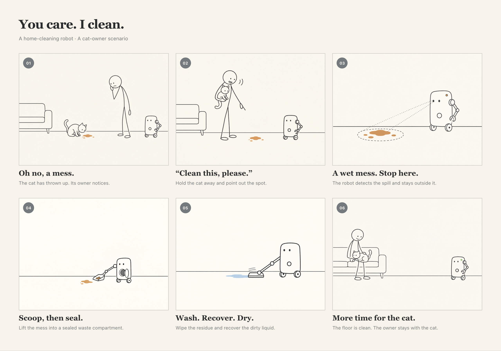

# Cat cleanup: You care. I clean.

A six-frame concept storyboard for a new home-cleaning robot. This is an independent design exercise, separate from the Interactive Device Design labs.

[HTML source / local preview](storyboard-cat-cleanup.html) · [Full-resolution PNG](storyboard-cat-cleanup-render.png) · [Generation prompts](assets/storyboard-cat-cleanup/prompts.md)

## Scenario

A cat has just vomited on the living-room floor. Its owner wants to stay with the cat but also needs to clean up. The owner lifts the cat away from the spill and asks the robot for help. The robot recognizes a wet mess, stops outside it, collects the bulk material into a sealable waste compartment, and then washes and recovers the remaining liquid. Once the floor is dry, the robot signals completion. The owner remains with the cat.

The value beyond ordinary vacuuming is **handling a mixed wet mess without driving through it**, while freeing the owner to care for their pet.

## Six story beats

| Frame | Caption | What happens |
| --- | --- | --- |
| 01 | Oh no, a mess. | The owner notices that the cat has vomited and looks concerned. |
| 02 | “Clean this, please.” | The owner holds the cat away from the spill and points out the cleanup area. |
| 03 | A wet mess. Stop here. | The robot detects the spill and stops with its wheels on clean floor. |
| 04 | Scoop, then seal. | An arm collects the bulk material and transfers it into a sealable waste compartment. The illustration shows the collection moment with the hatch open; it is closed in frame 05. |
| 05 | Wash. Recover. Dry. | A separate cleaning head wipes the residue and recovers liquid. The blue trace represents the wet side of the pass; the ivory area behind it is the cleaned side. |
| 06 | More time for the cat. | The floor is clear and dry; a green status light signals completion while the owner sits with the cat. |

Read left to right, then continue on the lower row. These are successive moments, not a measured timeline.

## Ideation: Verplank concept check

| Element | Design intent |
| --- | --- |
| Idea | Let an owner care for their cat while a robot handles an unpleasant cleanup. |
| Error | Cleanup competes with caring for the pet; driving through a wet mess could spread it. This is a scenario hypothesis, not a measured finding about a specific product. |
| Metaphor | A careful helper using a dustpan first and a cloth afterward. The sequence makes the robot's actions understandable. |
| Scenario | At home, just after a cat vomits on a hard living-room floor. |
| Model | Detect and stop → collect and contain → wash and recover liquid → report completion. Wheels remain outside the contaminated area during the illustrated cleaning actions. |
| Task | The owner moves the cat away and requests cleanup; the robot performs the cleanup sequence; the owner can remain with the cat. |
| Display | A spoken acknowledgment and an amber indicator communicate that the spill has been detected; a green indicator communicates completion. Detection rays and the dashed spill boundary are explanatory drawing conventions, not a projected interface. |
| Control | A voice request and pointing gesture identify the spot. A proposed “Stop” command pauses motion if the owner intervenes; this alternate path is not shown in the six-frame story. |

## Scope and assumptions

- **User requirements:** a new home-cleaning robot, a cat vomiting on the floor, exactly six storyboard images, a simpler stick-figure style, and the workspace storyboard workflow.
- **Proposed design choices:** voice-and-point initiation, a single tool-changing arm, sealed waste collection, wet cleaning with liquid recovery, and a completion indicator.
- **Visual choices:** one owner, one cat, one robot; sparse warm-paper line drawings; non-graphic ochre marks for the spill; minimal English captions.
- **Not yet demonstrated:** reliable mess detection, a reachable spill boundary, tool change and transfer mechanics, compartment capacity and sealing, cleaning efficacy, dry-floor detection, and pet-aware stopping. The arm mounting and tools are concept sketches rather than an engineering drawing.
- The six panels assume a compatible hard floor and a localized mess within the arm's reach. Carpets, large splashes, nearby obstacles, and a cat returning to the area need additional scenarios.
- Waste disposal and cleaning/replacement of contaminated tools are a remaining maintenance interaction. A complete product concept should show who does that and how; these six frames do not claim maintenance-free operation.
- The ending depicts the owner's attention and relief, not a medical assessment of the cat or a claim that the cat has recovered. No sterilization or disinfection claim is made.

## Visual production and validation

The six frame images were generated independently with built-in Imagegen. Frame 04 was corrected to keep the already-moved cat and owner out of the cleaning close-up; frame 05 was corrected to remove an unused joint. The final board uses the workspace HTML template, with six 4:3 images displayed in full and captions rendered as text.

The workspace Playwright exporter rendered the HTML at 1280 CSS pixels and 2× device scale. The verified final PNG is **2560 × 1794 pixels**. All six images loaded, the exporter reported no horizontal overflow, and the final PNG was visually checked for sequencing, image-caption agreement, readable text, and clipping. This verifies the artifact, not the proposed robot's real-world behavior.

## AI disclosure

The user supplied the cat-vomit scenario, six-frame requirement, and stick-figure preference. Codex developed the interaction sequence, captions, design assumptions, HTML layout, and documentation. Built-in Imagegen generated and corrected the illustrations. This is an AI-assisted concept visualization, not a record of a built or tested robot.
